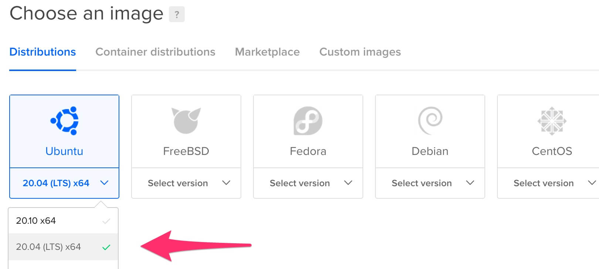
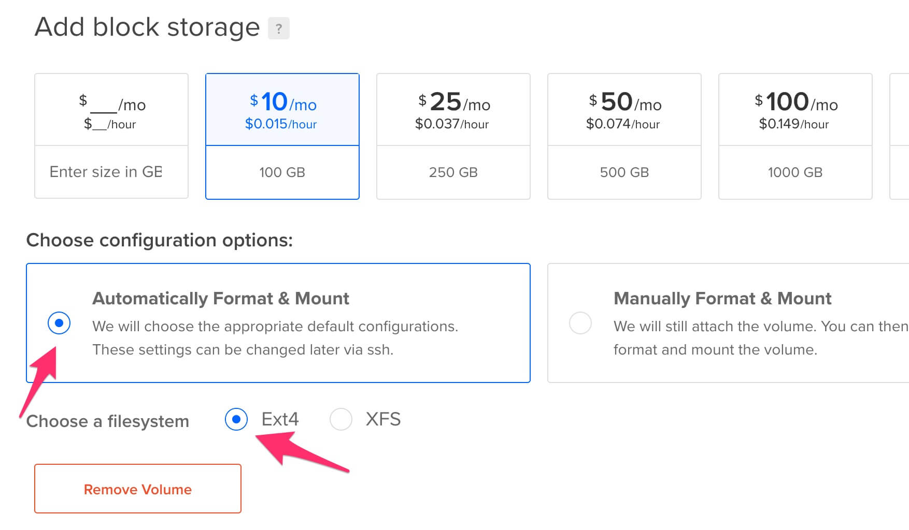
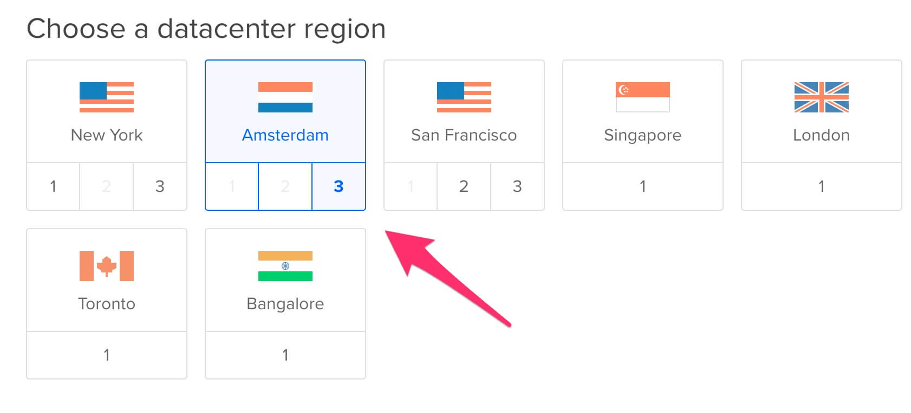
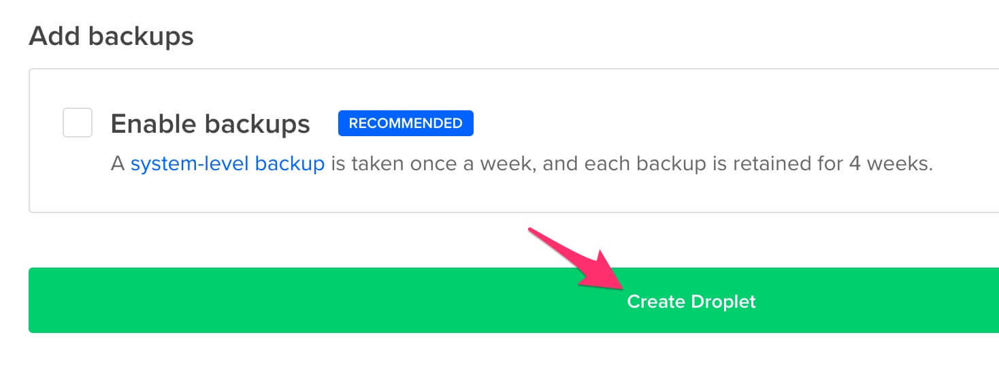

How to deploy Ephyr re-streamer to DigitalOcean
===============================================

This guide provides a common and recommended way to deploy Ephyr re-streamer application as a standalone droplet on [DigitalOcean].


## 0. Prerequisites 

You should have a registered account on [DigitalOcean] with a [payment method attached to it][1].


## 1. Create droplet

Open the [page of droplet creation][2].


### 1.1. Choose Ubuntu 20.04 LTS image



> __WARNING__: Other images are not supported! Do NOT select them!


### 1.2. Choose desired resources

For simple re-streaming the cheapest one should be enough. But if you're going to run a very large amount of re-streams, consider a more performant variant.


### 1.3. Attach volume (optional)

> __NOTE__: Skip this step if you're not going to do recording into files.

If you're going to record live streams into files you may need a larger disk size than the one provided by default in the droplet. This can be fulfilled by creating and attaching an external volume to the created droplet.

  


Provision script will automatically detect and use it for Ephyr re-streamer.


### 1.4. Choose a region

Consider the region, which is the closest both to source endpoints (where the RTMP stream origin goes from) and destination endpoints (where the RTMP stream is re-streamed to).




### 1.5. Inject provision script

To install Ephyr re-streamer onto a newly created droplet, we should specify a provision script for doing that installation job.

Paste the text below to the `User data` section.
```bash
#!/bin/bash
curl -sL https://tinyurl.com/k46y7v3c | EPHYR_VER=0.3.0 bash -s
```


### 1.6. Setup SSH access

[DigitalOcean] requires the created droplet to be accessible via [SSH].

It's not required for using Ephyr re-streamer, so just specify a random password. Or specify an appropriate [SSH] key if you know what you're doing.


### 1.7. Provide droplet's name

Specify a custom name of the droplet to not forget its purpose, or just go with a default one if you don't bother about it.


### 1.8. Proceed with a droplet creation

Do not use backups. They are redundant as Ephyr re-streamer doesn't store any data.




## 2. Access Ephyr re-streamer

After you've launched a droplet creation, wait from 5 to 15 minutes until it is provisioned and Ephyr re-streamer is installed.


Use IP address of the created droplet in browser's address bar to access the installed Ephyr re-streamer(Web UI may look a bit different from the picture below).


> __WARNING__: Do NOT use `https://` scheme in browser's address. ONLY `http://` is supported. 


[DigitalOcean]: https://digitalocean.com
[SSH]: https://en.wikipedia.org/wiki/SSH_(Secure_Shell)

[1]: https://cloud.digitalocean.com/account/billing
[2]: https://cloud.digitalocean.com/droplets/new
