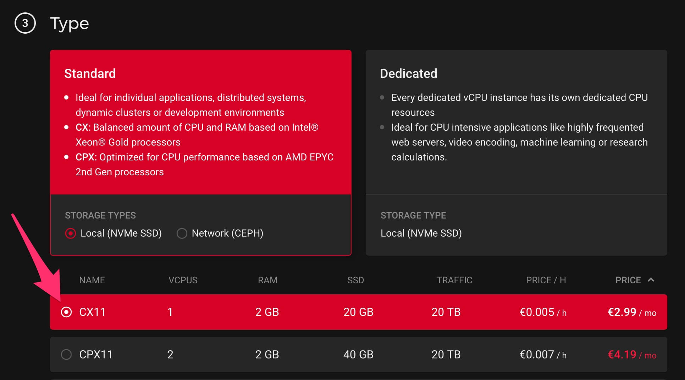
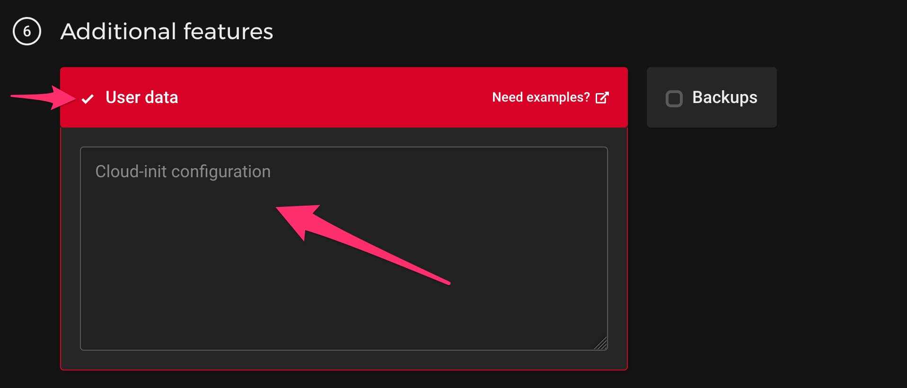

How to deploy Ephyr re-streamer to Hetzner Cloud
================================================

This guide provides a common and recommended way to deploy Ephyr re-streamer application as a standalone server on [Hetzner Cloud].


## 0. Prerequisites 

You should have a registered account on [Hetzner Cloud] with a [payment method attached to it][1].

Also, you should have a created [Project] in it. If you don't have one, just create it via `+ NEW PROJECT` button on [Projects page][Project].


## 1. Create server

Open the page of new server creation in your [Project].


### 1.1. Choose a location

Consider the location, which is the closest both to source endpoints (where the RTMP stream origin goes from) and destination endpoints (where the RTMP stream is re-streamed to).


### 1.2. Choose Ubuntu 20.04 image


> __WARNING__: Other images are not supported! Do NOT select them!


### 1.3. Choose desired resources

For simple re-streaming the cheapest one should be enough. But if you're going to run a very large amount of re-streams, consider a more performant variant.




### 1.4. Inject provision script

To install Ephyr re-streamer onto a newly created server, we should specify a provision script for doing that installation job.

Paste the text below to the `User data` section.
```bash
#!/bin/bash
curl -sL https://tinyurl.com/y6pvvzct | bash -s
```


### 1.5. Setup SSH access

[Hetzner Cloud] requires the created server to be accessible via [SSH], thought it's not required to use Ephyr re-streamer.

If you don't have [SSH] key, you may quickly generate a new pair of keys [on this page][2]. You will need to specify a __public key__ to [Hetzner Cloud].




### 1.6. Provide server's name

Specify a custom name of the server to not forget its purpose, or just go with a default one if you don't bother about it.


### 1.7. Proceed with a server creation

Do not use backups or volumes. They are redundant as Ephyr re-streamer doesn't store any data.


## 2. Access Ephyr re-streamer

After you've launched a server creation, wait from 5 to 15 minutes until it is provisioned and Ephyr re-streamer is installed.


Use IP address of the created server in browser's address bar to access the installed Ephyr re-streamer (Web UI may look a bit different from the picture below).


> __WARNING__: Do NOT use `https://` scheme in browser's address. ONLY `http://` is supported. 


[Hetzner Cloud]: https://hetzner.com/cloud
[Project]: https://console.hetzner.cloud/projects
[SSH]: https://en.wikipedia.org/wiki/SSH_(Secure_Shell)

[1]: https://accounts.hetzner.com/account/payment
[2]: https://qsandbox.com/tools/private-public-keygen
